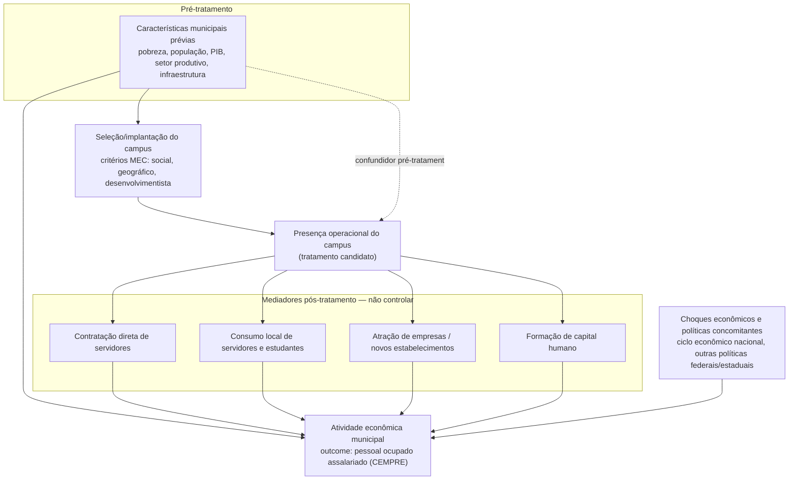

# Contrato Causal

## Data da decisão

2026-09-08 (decisões analíticas iniciais).

**Consolidação do Desenho Causal v1: 2026-09-12**, após aprovação e
versionamento do cadastro causal preliminar
(`docs/methodology/CADASTRO_CAUSAL_TRATAMENTO_FASE_II.md`, commit
`146354a`). Esta consolidação sincroniza o contrato com o cadastro
reproduzível e formaliza pergunta, estimando, grupo de comparação,
antecipação, spillovers e DAG — sem estimar nenhum efeito.

## Uso

Trabalho final da disciplina de Big Data & Analytics, com finalidade de
exercício metodológico rigoroso.

---

## Pergunta de pesquisa

> Qual foi o efeito da chegada de campi da Expansão Fase II da Rede
> Federal de Educação Profissional, Científica e Tecnológica sobre a
> atividade econômica dos municípios brasileiros?

Elementos explícitos da pergunta:

- **Intervenção**: chegada (presença operacional) de um campus associado
  à Expansão Fase II no município.
- **Unidade de análise**: município-ano.
- **Período**: 2007–2019.
- **População de interesse**: os 147 municípios oficiais da Expansão Fase
  II (população institucional) — não qualquer conjunto arbitrário de
  municípios com presença federal.
- **Outcome primário**: pessoal ocupado assalariado do CEMPRE.
- **Caráter do tratamento**: escalonado (staggered adoption) — municípios
  são tratados em anos diferentes; o tratamento é conceitualmente
  absorvente.

A redação ainda pode ser refinada por revisão de literatura, mas não deve
ser ampliada além do escopo acima nem alterada por conveniência do
resultado estimado.

## Unidade

Município-ano.

## Janela

2007–2019.

---

## Outcome primário

Pessoal ocupado assalariado do CEMPRE.

### Por que este outcome

O tratamento candidato — presença operacional de um campus federal — tem
como canal mais direto e mensurável a contratação de servidores e
terceirizados vinculados ao próprio campus (professores, técnicos
administrativos, serviços de apoio) e o consumo local gerado por esses
servidores e pelos estudantes. Entre os candidatos considerados, pessoal
ocupado assalariado é o que captura esse canal de forma mais direta:
emprego formal assalariado no município, seja pelo emprego público
direto, seja pelo emprego privado induzido (comércio e serviços locais).
Essa escolha foi feita **antes da observação de qualquer efeito estimado**
e não será revista com base no resultado do ATT.

## Outcomes secundários

- pessoal ocupado total;
- número de unidades locais;
- salário médio mensal.

Mantidos como secundários pelo mesmo raciocínio institucional: são canais
adjacentes (criação de estabelecimentos, efeito salarial, emprego não
assalariado) plausíveis pelo mesmo mecanismo, mas não o canal mais direto.

---

## Tratamento candidato

**Presença operacional de campus associado à Expansão Fase II no
município.**

Sob essa definição, o tratamento é conceitualmente absorvente: uma vez
presente, o campus não deixa de ter existido. O timing observado no Censo
Escolar (primeiro ano com EPT federal ativa) é usado como **proxy anual**
dessa presença operacional — não é necessariamente o ano de criação,
autorização, inauguração ou início das aulas, e essas datas
institucionais, quando documentadas, têm precedência sobre a proxy (ver
`CADASTRO_CAUSAL_TRATAMENTO_FASE_II.md`).

### Tratamento absorvente e intermitência

A presença operacional é conceitualmente absorvente: depois que existe,
não regride. Isso não significa que toda série observada no Censo deva
ser tratada como absorvente por padrão — quando a série é intermitente
(uma lacuna observada na flag de EPT ativa) e não há evidência
institucional de que a lacuna representa apenas uma oscilação
classificatória (e não um fechamento real), o município permanece **sob
revisão**, fora da especificação absorvente principal, até que exista uma
trajetória operacional defensável. Ver
`CADASTRO_CAUSAL_TRATAMENTO_FASE_II.md`, seção "Tratamento absorvente e
trajetórias intermitentes", para os casos concretos (Jequié/BA, Nossa
Senhora da Glória/SE, Piracicaba/SP vs. Montes Claros/MG).

---

## Cadastro causal aprovado (estado atual, 2026-09-12)

O cadastro causal preliminar (`src/constroi_cadastro_causal_fase_ii.py`,
documentado em `docs/methodology/CADASTRO_CAUSAL_TRATAMENTO_FASE_II.md`)
substitui o estado exploratório anterior como referência corrente para a
população institucional e a elegibilidade temporal. Ele contém:

| População / status | N | Definição |
|---|---:|---|
| Municípios oficiais (população institucional) | 147 | `fase_ii=true`, `ever_treated=true`, `pode_ser_controle=false` para todos os 147, sem exceção. |
| Candidatos preliminares à amostra principal | 129 | `candidato_amostra_principal=true`: status curado + coorte definida + elegibilidade temporal mínima (2 pré/3 pós). |
| Candidatos com ressalva | 10 | Identidade institucional razoavelmente estabelecida, mas timing ou proveniência ainda incompletos. |
| Sob revisão | 5 | Timing incerto (intermitência sem validação institucional, ou operação documentada sem ano civil completo confirmado). |
| Excluídos da população principal | 2 | Brasília/DF e Duque de Caxias/RJ — expostos institucionalmente, mas sem ano de primeira exposição defensável dentro do painel; **nunca utilizáveis como controle**. |
| Estimando especial | 1 | Porto Alegre/RS — presença federal preexistente desde 2007; a chegada do Campus Restinga é uma expansão adicional, não a primeira exposição do município. |

### Três camadas que não devem ser confundidas

1. **População institucional**: os 147 municípios oficiais, sem filtro —
   todos `ever_treated=true`, nenhum pode ser controle.
2. **Elegibilidade temporal**: subconjunto que atende a uma janela mínima
   de pré/pós dentro de 2007–2019 — condição **mecânica e necessária**,
   nunca suficiente.
3. **População causal identificável**: ainda não existe. Depende da
   reconstrução do pool de comparação, do common support e do
   matching/balanceamento (fora do escopo do cadastro e deste contrato).
   Os 129 candidatos preliminares **não devem ser lidos como a amostra
   final** — são o ponto de partida institucional e temporal para a etapa
   seguinte, não uma autorização para estimar.

### Nota histórica — populações exploratórias anteriores

As contagens abaixo vêm da fase exploratória, **anterior** ao cadastro
reproduzível acima, e permanecem preservadas apenas como referência
histórica — nunca como população causal corrente:

- **144 municípios**: contagem documental sem lista de códigos IBGE
  disponível para reconciliação individual (ver
  `AUDITORIA_TIMING_TRATAMENTO.md` e `AUDITORIA_LISTA_FASE_II.md`, que
  reconstroem 147 e deixam a diferença de 3 como aberta, não resolvida
  por ajuste numérico).
- **119 tratados históricos** (37+65+14+3, coortes 2010–2013): população
  sem chave municipal; não deve ser confundida com o "119" que a auditoria
  de timing produz por coincidência numérica sob uma regra de
  elegibilidade diferente (3 pré/3 pós) — ver `AUDITORIA_TIMING_TRATAMENTO.md`.
- **53 tratados em common support exploratório** e **47 pares da amostra
  core exploratória** (coortes 2010–2011): não há artefato reproduzível
  que identifique individualmente o common support, o matching ou os
  pares. Essas populações **não são substituídas automaticamente** pelos
  129 candidatos atuais — são conjuntos diferentes, obtidos por métodos
  diferentes, e a diferença deve ser reconstruída explicitamente (matching
  + common support), não presumida.

Nenhum destes números históricos deve orientar estimação, seleção de
controles ou definição de população causal enquanto não for reconstruído
com chaves municipais e regra reproduzível.

## Grupo de comparação candidato

Ainda não existe um **pool nacional de controles reproduzível**. O pool
futuro **não pode incluir automaticamente todos os municípios brasileiros
fora dos 147** — antes de qualquer estimação, é preciso identificar e
excluir, conforme o desenho final:

- municípios tratados pela própria Expansão Fase II (os 147 — já cobertos
  pelo cadastro);
- municípios com presença federal anterior (outras entidades federais com
  EPT ativa antes da janela, mesmo fora dos 147);
- municípios tratados por outras fases de expansão da Rede Federal (Fase
  I, expansões posteriores);
- municípios que recebam campus **durante** a janela de estimação, caso
  seja adotado never-treated como desenho principal;
- municípios potencialmente contaminados por spillover geográfico de um
  município tratado;
- municípios sem dados suficientes ou sem suporte comum nas covariáveis
  pré-tratamento.

### Decisões abertas (não escolhidas nesta etapa)

- **never-treated vs. not-yet-treated** como comparação principal;
- eventual uso combinado de not-yet-treated (com os cuidados de viés que
  Callaway–Sant'Anna exige);
- critérios geográficos de exclusão por spillover (ver seção
  "Spillovers");
- covariáveis usadas no suporte comum (dependem do DAG abaixo).

Nenhuma dessas alternativas é escolhida nesta etapa; a escolha exige
fundamentação substantiva e não pode ser motivada pelo resultado do ATT.

---

## Estimador principal candidato

Callaway–Sant'Anna, para adoção escalonada.

TWFE convencional **não será usado como estimador causal principal.**

## Estimando candidato

Em linguagem comum: o efeito médio do tratamento para os municípios
institucionalmente associados à Fase II — **condicionado** simultaneamente
a (i) elegibilidade temporal mínima, (ii) validade do timing (proxy do
Censo confirmada ou substituída por evidência institucional) e (iii)
existência de suporte comum com o grupo de comparação ainda a construir
—, decomposto por coorte de tratamento e por tempo desde o tratamento
(event-time).

Em notação aproximada (Callaway–Sant'Anna), para coorte de tratamento $g$
e tempo $t$:

$$ATT(g, t) = E\big[Y_t(g) - Y_t(\infty) \mid G = g\big], \quad t \ge g$$

onde $Y_t(g)$ é o outcome potencial no ano $t$ para um município tratado
pela primeira vez no ano $g$, e $Y_t(\infty)$ é o outcome potencial sob
nunca-tratamento. O ATT agregado (por coorte, por tempo desde o
tratamento, ou geral) é uma média ponderada dos $ATT(g,t)$ sobre o
conjunto de $(g,t)$ efetivamente identificável — **não sobre os 147
municípios institucionais**, nem sobre os 129 candidatos preliminares por
definição, mas sobre o subconjunto que sobreviver à elegibilidade
temporal, à validação de timing e ao suporte comum.

Duas advertências explícitas:

- **Os 129 candidatos preliminares não formarão necessariamente a amostra
  final.** Eles são o ponto de partida institucional e temporal; a
  amostra efetivamente estimada será um subconjunto, definido por common
  support e pelas regras de spillover/antecipação ainda abertas.
- **Os antigos 47 pares não se tornam a população principal por
  decreto.** Se a amostra de 2010–2011 em common support for
  reconstruída, isso exige refazer matching e common support com o
  cadastro atual — não reaproveitar o resultado exploratório antigo.

---

## Antecipação

Ainda não decidido se a janela de antecipação é:

- zero (nenhum efeito antes do primeiro ano de presença operacional);
- um ano;
- outra janela institucionalmente justificável (ex.: alinhada ao
  intervalo típico entre autorização e início das obras, quando essa
  informação existir por município).

Anúncio da cidade-polo, obras, contratação de pessoal e preparação do
campus podem produzir efeitos econômicos (emprego na construção,
expectativa de valorização, contratações administrativas antecipadas)
**antes** do primeiro ano civil completo de operação — a proxy do Censo
Escolar, por construção, não captura esses efeitos antecipados. Nenhuma
janela é fixada nesta etapa; a decisão depende de evidência institucional
ainda a levantar (datas de autorização/obras por município) e de análise
de sensibilidade sobre os leads do event study.

## Spillovers

Mecanismos possíveis a considerar, sem fixar automaticamente um critério
de exclusão:

- deslocamento de estudantes entre municípios vizinhos (um campus pode
  atrair estudantes de municípios de controle candidatos);
- deslocamento de trabalhadores (servidores e terceirizados podem residir
  em município vizinho);
- contratação e compras locais que extravasam a fronteira municipal
  (mercado de trabalho e de fornecedores compartilhado);
- municípios vizinhos que compartilham o mesmo mercado de trabalho local
  (commuting zones informais);
- efeitos sobre comércio e serviços regionais além do município-sede do
  campus.

Distâncias como 30 km ou 50 km **não são fixadas aqui**: qualquer raio de
exclusão exige justificativa substantiva (ex.: dados de deslocamento
pendular) ou análise de sensibilidade comparando resultados com e sem a
exclusão — nunca escolha por conveniência ou pelo efeito estimado.

---

## DAG causal

### Explicação didática

- **Características municipais prévias (X)** são **confundidoras
  pré-tratamento**: influenciam tanto a probabilidade de o município ser
  selecionado como cidade-polo (via critérios do MEC — social, geográfico,
  desenvolvimentista) quanto a trajetória da atividade econômica,
  independentemente do campus. É por isso que a seleção não é aleatória e
  por isso o desenho precisa de matching/balanceamento nessas variáveis —
  nunca em variáveis medidas depois do tratamento.
- **Seleção/implantação (S)** é o elo entre as características prévias e
  a presença operacional: um município só chega a ter campus (P) se antes
  foi selecionado.
- **Presença operacional (P)** é o tratamento candidato deste projeto — a
  seta pontilhada de X para P é o confundimento que a identificação
  precisa neutralizar.
- **Mediadores pós-tratamento** (contratação direta, consumo local,
  atração de empresas, formação de capital humano) são os **canais pelos
  quais o tratamento afeta o outcome** — eles não devem ser usados como
  covariável de matching ou controle na estimação do ATT, porque são
  consequência do próprio tratamento (controlar por eles bloquearia parte
  do efeito que se quer medir, um viés de seleção pós-tratamento).
- **Choques econômicos e políticas concomitantes (Z)** afetam o outcome
  diretamente e não são causados pelo tratamento — são a justificativa
  para clusterização/inferência cuidadosa e para o uso de um estimador
  robusto a tendências temporais comuns (Callaway–Sant'Anna, não TWFE
  ingênuo).
- **Outcome (Y)** é pessoal ocupado assalariado do CEMPRE, afetado pelas
  características prévias (diretamente, via trajetória própria do
  município), pelos mediadores (via o tratamento) e pelos choques
  concomitantes.

Este DAG é uma representação de trabalho, não uma afirmação fundamentada
em literatura já revisada sobre a magnitude de cada seta — **a revisão de
literatura necessária para validar ou refinar as covariáveis de
balanceamento permanece pendente** (ver `PROTOCOLO_PRE_ANALISE.md`, seção
6.9, e `ROADMAP_ACADEMICO.md`).

---

## Critério de interpretação

- suporte e balanceamento adequados;
- leads avaliados por magnitude e incerteza, não apenas p-valor;
- ausência de antecipação relevante;
- resultado não explicado exclusivamente por uma coorte;
- heterogeneidade entre coortes não invalida automaticamente;
- significância do ATT não define sucesso;
- pré-tendências economicamente relevantes, ausência de suporte ou
  contaminação dos controles invalidam a interpretação causal.

---

## Itens ainda abertos

- grupo de comparação (never-treated vs. not-yet-treated, critérios de
  exclusão);
- antecipação (janela);
- spillovers (critério geográfico);
- inferência e clusterização;
- validação institucional do timing para os 10 candidatos com ressalva e
  os 5 sob revisão (ver `CADASTRO_CAUSAL_TRATAMENTO_FASE_II.md`);
- covariáveis de balanceamento fundamentadas por literatura (o DAG acima
  é estrutura de trabalho, não literatura revisada).

## Próxima etapa

Ver `ROADMAP_ACADEMICO.md` — sequência técnica pós-aprovação do cadastro
(cadastro nacional de exposição, pool de controles, painel CEMPRE,
covariáveis, regras de spillover/antecipação, common support, só então
event study/ATT).

---

## Status do documento

- Decisões analíticas ex ante registradas; Desenho Causal v1 consolidado
  em 2026-09-12 após aprovação do cadastro causal preliminar.
- Desenho causal ainda não validado quanto a common support, matching e
  grupo de comparação.
- Nenhum efeito causal estimado.
- Contrato sujeito somente a alterações motivadas por evidência
  institucional ou erro documentado, nunca pelo resultado do ATT.
