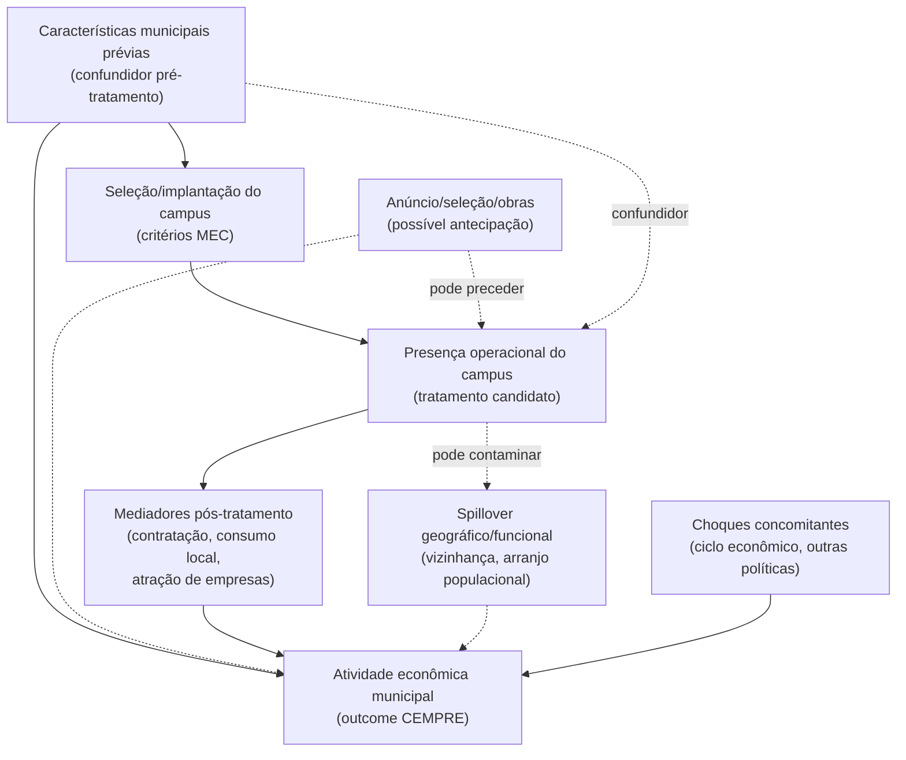

# Revisão Integrada do Desenho Causal

## Finalidade

Este documento é uma **revisão de coerência**, não uma nova análise nem
uma decisão. Ele confronta as peças já construídas — cadastro
institucional, cadastro nacional de exposição, pool de controles,
diagnósticos de spillover (distância e arranjos populacionais) — com o
`CONTRATO_CAUSAL.md` e o `PROTOCOLO_PRE_ANALISE.md`, aponta o que está
coerente, o que ainda está aberto e o que exige decisão de Ariel antes de
qualquer estimação. Nenhuma regra de spillover, grupo de comparação,
antecipação ou covariável é fixada aqui. Nenhum artefato foi executado ou
regenerado para esta revisão; todos os números citados foram lidos
diretamente dos artefatos existentes (caminho indicado em cada linha).

Estado de referência confirmado nesta sessão: HEAD `2637162`, branch
`main`, `origin/main` no mesmo commit, árvore de trabalho **estava limpa
antes da criação deste documento** — este próprio arquivo é a única
pendência introduzida, como novo/untracked, pela criação desta revisão.

---

## 1. Pergunta e estágio atual, em linguagem simples

A pergunta (`CONTRATO_CAUSAL.md`, "Pergunta de pesquisa") é: será que a
chegada em funcionamento de um campus da Expansão Fase II mudou o nível
de emprego assalariado formal do município? O projeto já decidiu **o
que** quer perguntar, **quem** é a população institucional (147
municípios) e **qual** proxy de timing usar. O que ainda não tem é: (i)
um pool de comparação depurado por spillover, (ii) o painel econômico do
CEMPRE, (iii) covariáveis de balanceamento, e (iv) qualquer suporte
comum ou matching. Ou seja: o projeto está na fronteira entre "montamos
os insumos estruturais" e "ainda não podemos rodar nada que pareça
estimação".

Cinco camadas populacionais precisam ficar sempre separadas (fonte:
`CONTRATO_CAUSAL.md`, "Cadastro causal aprovado"; `CADASTRO_CAUSAL_TRATAMENTO_FASE_II.md`,
"Populações distintas"):

1. **População da política** — os 147 municípios oficiais da Fase II.
   Todos `ever_treated=true`, nenhum pode ser controle.
2. **Candidatos tratados elegíveis temporalmente** — 129 municípios
   (`candidato_amostra_principal=true` em
   `outputs/diagnostics/cadastro_causal_tratamento_fase_ii.csv`):
   status curado + coorte definida + elegibilidade temporal mínima.
   **Não são a amostra causal final.**
3. **Coortes do estimando** — o `ATT(g,t)` de Callaway–Sant'Anna é
   definido por coorte de primeiro tratamento `g`; os 129 candidatos se
   distribuem em coortes 2009–2013 (2009: 21; 2010: 27; 2011: 66; 2012:
   13; 2013: 2 — recontado nesta sessão a partir do CSV acima).
4. **Candidatos a controle** — 4.964 municípios estruturalmente
   elegíveis (`data/processed/pool_candidato_controles_sem_exposicao_2007_2019.parquet`),
   definidos apenas por ausência de exposição observada + presença no
   universo do Censo + não pertencimento à Fase II. **Não são controles
   causais validados.**
5. **Futura amostra com suporte** — ainda não existe; depende de
   covariáveis, spillover, antecipação e common support (nenhum desses
   quatro insumos está pronto).

### 1.1 Os 15 casos especiais e sua relação com os 129

Dentro dos 147 institucionais, 18 têm `candidato_amostra_principal=False`
(conferido nesta sessão em `outputs/diagnostics/cadastro_causal_tratamento_fase_ii.csv`):
2 `excluido_principal` (Brasília/DF, Duque de Caxias/RJ) e 1
`especial_estimando` (Porto Alegre/RS) — já tratados como população à
parte em `CADASTRO_CAUSAL_TRATAMENTO_FASE_II.md` — mais **15 casos**
assim divididos, categorias mutuamente exclusivas:

- **10** com `status_populacao_causal=candidato_com_ressalva`;
- **5** com `status_populacao_causal=sob_revisao`.

**Esses 15 têm `candidato_amostra_principal=False` e portanto não fazem
parte dos 129 atuais** — são uma população separada, não um subconjunto
nem uma reserva já contada dentro dos 129. Dentro dos 15: **7** têm
`validacao_institucional_individual=True` e **8** têm
`validacao_institucional_individual=False`. Separadamente,
`revisao_prioritaria=True` vale para **17** municípios — os 15 acima mais
Brasília/DF e Porto Alegre/RS (conferido nesta sessão: `revisao_prioritaria.sum()==17`).

Quatro campos distintos, que não devem ser confundidos: `status_populacao_causal`
(categoria institucional), `validacao_institucional_individual` (se houve
pesquisa em fonte externa ao painel), `revisao_prioritaria` (fila de
revisão, independente da validação) e `candidato_amostra_principal`
(elegibilidade para a amostra principal atual). Os 15 têm
`candidato_amostra_principal=False` e não estão contidos nos 129 atuais.
Resolver essas pendências pode fundamentar inclusões futuras; não reduz
os 129 atuais por essa classificação — mas eventual inclusão futura não
é automática: cada caso ainda depende de revisão individual, que também
pode confirmar sua permanência fora da população candidata. Além disso,
a futura amostra identificável continua podendo ser menor que 129 por
cobertura, suporte comum, balanceamento e outras condições de
identificação, independentemente do que ocorrer com esses 15. Os 15
também não bloqueiam a inspeção do CEMPRE (seção 8) nem a revisão
bibliográfica (seção 10); bloqueiam apenas sua própria
inclusão/interpretação causal enquanto suas pendências não forem
resolvidas.

---

## 2. Matriz: decisão / evidência e caminho / status / implicação

| Decisão | Evidência e caminho | Status | Implicação |
|---|---|---|---|
| Pergunta de pesquisa, unidade, janela 2007–2019 | `CONTRATO_CAUSAL.md`, "Pergunta de pesquisa" | DECISÃO DOCUMENTADA | Ancora escopo; qualquer ampliação exige justificativa, não conveniência. |
| Outcome primário = pessoal ocupado assalariado (CEMPRE) | `CONTRATO_CAUSAL.md`, "Outcome primário"; decidido antes de qualquer estimativa | DECISÃO DOCUMENTADA | Painel CEMPRE ainda não construído — outcome está definido, dado não existe. |
| Tratamento = presença operacional de campus (proxy: Censo Escolar) | `CONTRATO_CAUSAL.md`, "Tratamento candidato"; `CADASTRO_CAUSAL_TRATAMENTO_FASE_II.md` | DECISÃO DOCUMENTADA | Proxy ≠ data institucional; 10 candidatos com ressalva e 5 sob revisão (`candidato_amostra_principal=False`, portanto **fora** dos 129) ainda pendem de validação individual — ver seção 1.1. |
| 147 municípios institucionais, 129 candidatos preliminares | `CADASTRO_CAUSAL_TRATAMENTO_FASE_II.md`; recontado nesta sessão em `outputs/diagnostics/cadastro_causal_tratamento_fase_ii.csv` (129 linhas com `candidato_amostra_principal=True`) | CONFIRMADO NOS ARTEFATOS | Base institucional sólida; não é ainda amostra causal. |
| 21 em 2009, 27 em 2010 (48 com coorte ≤2010), 93 em 2010–2011 | Recontado nesta sessão a partir do mesmo CSV: `value_counts()` de `ano_coorte_candidata` sobre `candidato_amostra_principal=True` | CONFIRMADO NOS ARTEFATOS | Sustenta a advertência temporal dos arranjos populacionais (item abaixo). **Não existe decisão vigente do contrato priorizando 2010–2011** — essas coortes aparecem concentradas apenas no histórico exploratório dos antigos 47 pares (seção 3), resultado hoje não reprodutível; a escolha da população/coortes do estimando permanece ABERTO. |
| Estimador principal candidato = Callaway–Sant'Anna; TWFE excluído | `CONTRATO_CAUSAL.md`, "Estimador principal candidato" | DECISÃO DOCUMENTADA | Compatível com adoção escalonada; não decide ainda never- vs. not-yet-treated. |
| Cadastro nacional de exposição (5.570 municípios, regra `TP_DEPENDENCIA`∧`TP_SITUACAO_FUNCIONAMENTO`∧`IN_PROF`) | `CADASTRO_NACIONAL_EXPOSICAO_REDE_FEDERAL.md`, seções 4 e 11 | CONFIRMADO NOS ARTEFATOS | Mede exposição observada, não tratamento Fase II nem "never-treated" causal — nomenclatura do próprio documento evita esses termos. |
| Pool candidato a controle = 4.964 municípios | `POOL_CANDIDATO_CONTROLES.md`, seção 8; conferido nesta sessão (`len(pool)=4964`) | CONFIRMADO NOS ARTEFATOS | É filtro estrutural (exposição + universo + Fase II), não pool causal final — spillover, CEMPRE, covariáveis e suporte comum ainda faltam. |
| Diagnóstico de distância sede-a-sede (25/50/100 km) | `DIAGNOSTICO_SPILLOVER_FASE_II.md` | CONFIRMADO NOS ARTEFATOS / PROPOSTA (como insumo, não regra) | Nenhum raio é regra causal; documento already afirma isso explicitamente. |
| Diagnóstico de Arranjos Populacionais 2010 (145 candidatos compartilham arranjo com Fase II; 4.819 restariam sem eles) | `DIAGNOSTICO_ARRANJOS_POPULACIONAIS_FASE_II.md`; conferido nesta sessão diretamente no parquet (`fl_mesmo_arranjo_populacional_fase_ii.sum()==145`; `4964-145==4819`) | CONFIRMADO NOS ARTEFATOS | Diagnóstico, não regra de exclusão; risco temporal explícito para coortes ≤2010 (ver seção 3). |
| Nenhuma UF zerada ao excluir os 145 | Conferido nesta sessão diretamente no parquet (`set` de UFs igual antes/depois) | CONFIRMADO NOS ARTEFATOS | Viabilidade amostral, não validade causal — o próprio documento do arranjo já afirma isso. |
| 93 tratados 2010–2011 mantêm ao menos 1 candidato remanescente na própria UF | Conferido nesta sessão cruzando `cadastro_causal_tratamento_fase_ii.csv` (UFs com tratado 2010–2011) contra o parquet de arranjos (UFs com candidato remanescente) — conjunto de UFs "sem controle remanescente" veio vazio | CONFIRMADO NOS ARTEFATOS | Só garante que existe *algum* candidato na UF — não garante suporte comum em covariáveis (ainda inexistentes). |
| Grupo de comparação final (never- vs. not-yet-treated) | `CONTRATO_CAUSAL.md`, "Decisões abertas"; `CADASTRO_CAUSAL_TRATAMENTO_FASE_II.md`, "Todos os 147 municípios pertencem à Fase II" | ABERTO | Bloqueia a definição do pool causal e do estimador de agregação. **Restrição atual**: todos os 147 municípios Fase II têm `pode_ser_controle=False` no cadastro vigente — não está atualmente autorizado usar municípios Fase II ainda não tratados como controles temporários (not-yet-treated). Isso seria uma alteração metodológica **nova**, que exigiria fundamentação explícita e reconciliação formal com o cadastro/contrato — não implementada nem autorizada por esta revisão. |
| Janela de antecipação | `CONTRATO_CAUSAL.md`, "Antecipação"; `PROTOCOLO_PRE_ANALISE.md`, 6.7 | ABERTO | Sem decisão, o event study não pode fixar o período de leads. |
| Regra de spillover (raio, arranjo, combinação) | `CONTRATO_CAUSAL.md`, "Spillovers"; `DIAGNOSTICO_SPILLOVER_FASE_II.md`; `DIAGNOSTICO_ARRANJOS_POPULACIONAIS_FASE_II.md` | ABERTO | Dois diagnósticos independentes existem; nenhum foi promovido a regra. |
| Covariáveis de balanceamento | `CONTRATO_CAUSAL.md`, "DAG causal", nota final | ABERTO | O DAG é hipótese de trabalho; revisão de literatura para validar covariáveis ainda pendente. |
| Painel econômico CEMPRE 2007–2019 | Não localizado nesta sessão em `data/processed/` nem em `docs/methodology/` | ABERTO | Pré-requisito mecânico para qualquer suporte comum, matching ou estimação — nada disso pode começar sem o outcome. |
| Inferência/clusterização | `PROTOCOLO_PRE_ANALISE.md`, 6.9 | ABERTO | Não urgente agora, mas deve ser decidido antes do event study. |
| Validação institucional dos 15 casos especiais (10 candidatos com ressalva + 5 sob revisão; **não fazem parte dos 129 atuais**) | `CADASTRO_CAUSAL_TRATAMENTO_FASE_II.md`, "Casos especiais"; ver seção 1.1 | ABERTO | Resolver essas pendências pode fundamentar inclusões futuras; não reduz os 129 atuais por essa classificação — mas a inclusão não é automática, e a futura amostra identificável continua podendo ser menor que 129 por cobertura, suporte e balanceamento. Não bloqueia inspeção do CEMPRE nem revisão bibliográfica. |

---

## 3. Inconsistências materiais vs. histórico arquivado

**Nenhuma inconsistência material** entre os oito documentos lidos. Os
números (147, 129, 21, 27, 48, 93, 4.964, 145, 4.819) foram recontados
diretamente nos artefatos nesta sessão e batem com o que cada documento
reporta.

Os números históricos exploratórios (144 municípios; 119 tratados
2010–2013; 53 em common support exploratório; 47 pares da amostra core)
estão **explicitamente arquivados** como não-substituíveis automaticamente
pelos atuais — `CONTRATO_CAUSAL.md`, "Nota histórica — populações
exploratórias anteriores", e `PROTOCOLO_PRE_ANALISE.md`, seção 5 (nota de
2026-09-12). Esta revisão **não recupera** essas populações nem os
pares/matching exploratórios como válidos.

Um ponto de atenção, não uma contradição factual: `CONTRATO_CAUSAL.md` e
`ROADMAP_ACADEMICO.md` ainda listam "construir cadastro nacional de
exposição" e "construir pool de controles" como próximos passos a partir
de 2026-09-12 — mas ambos os artefatos (`CADASTRO_NACIONAL_EXPOSICAO_REDE_FEDERAL.md`,
`POOL_CANDIDATO_CONTROLES.md`) e os dois diagnósticos de spillover já
foram construídos e commitados depois dessa data. É desatualização
textual do roadmap frente ao progresso real, resolvida pelo histórico de
commits, não pelo texto do roadmap isoladamente.

---

## 4. DAG conceitual e hipóteses

O DAG já existe em `CONTRATO_CAUSAL.md` ("DAG causal") e é adotado aqui
como **hipótese de trabalho**, não como literatura validada — o próprio
contrato afirma isso na nota final da seção. Rearranjado para destacar o
papel dos dois diagnósticos de spillover nesta revisão:

- **X → P e X → Y**: confundidoras clássicas pré-tratamento; matching/
  balanceamento deve usar só covariáveis pré-tratamento (nenhuma ainda
  incorporada).
- **A (antecipação)**: catalogada no contrato, sem janela fixada; ramo
  que pode adiantar efeitos sobre `Y` antes de `P` ser observado pela
  proxy do Censo.
- **M (mediadores)**: consequência de `P`, não deve entrar como
  covariável de controle (bloquearia parte do efeito).
- **SP (spillover)**: elo que os dois diagnósticos (distância e arranjo)
  tentam aproximar — desenhado como possivelmente **bidirecional no
  tempo** para candidatos próximos de tratados de coorte ≤2010: o
  pertencimento a um arranjo de 2010 pode, em tese, já ser parcialmente
  resultado de `P` para essas coortes (seta pontilhada "pode contaminar",
  não seta causal simples) — mesma advertência de
  `DIAGNOSTICO_ARRANJOS_POPULACIONAIS_FASE_II.md`, seção 5.1.
- **Z**: choques concomitantes, sem relação causal com `P`.

Nenhuma seta aqui afirma efeito comprovado — é hipótese de trabalho.

---

## 5. Alcance dos diagnósticos de spillover (síntese)

- **Sede municipal ≠ campus**: `DIAGNOSTICO_SPILLOVER_FASE_II.md`, seção
  5 — a distância é sede-a-sede, não campus-a-campus.
- **Vizinhança da Fase II ≠ toda a Rede Federal**:
  `CADASTRO_NACIONAL_EXPOSICAO_REDE_FEDERAL.md`, seção 2 — a proxy
  nacional não distingue Fase I, Fase II ou expansões posteriores.
- **Presença/ausência de flag não prova presença/ausência de
  spillover**: ambos os diagnósticos (distância e arranjo) afirmam isso
  em "O que esta rotina não demonstra" / "O que uma flag não demonstra".
- **Arranjos de 2010 têm risco temporal**: seção 5.1 do próprio
  diagnóstico de arranjos distingue coortes ≤2010 (risco de informação
  pós-tratamento) de >2010 (risco de desatualização) — corrigido em
  sessão anterior.
- **Preservar controles por UF não comprova suporte nas covariáveis**:
  confirmado nesta sessão — a verificação só garante existência de
  *algum* candidato na UF, não balanceamento em covariável nenhuma
  (nenhuma foi incorporada ainda).

**Status geral**: CONFIRMADO NOS ARTEFATOS quanto aos fatos citados;
qual diagnóstico (ou combinação) vira regra permanece ABERTO.

---

## 6. Seleção de controles por ausência de exposição 2007–2019

A hipótese central do pool (`POOL_CANDIDATO_CONTROLES.md`, seção 4): um
município sem `fl_presenca_federal_ept_ativa=true` em nenhum ano de
2007–2019 é candidato a controle — mas o documento nomeia essa
população como "candidato sem exposição observada", nunca "controle" ou
"never-treated", por quatro limites já explicitados: (1) a proxy é
observacional e mecânica; (2) ausência **dentro** da janela não garante
ausência **fora** dela; (3) nenhuma validação institucional individual
foi feita para os 4.964 (ao contrário dos 147 da Fase II); (4) suporte
comum, balanceamento e ausência de spillover não foram avaliados.

Esta revisão **não classifica** a hipótese como válida ou inválida: é
internamente consistente como *primeiro filtro estrutural*, insuficiente
como definição final de controle. Status: DECISÃO DOCUMENTADA (regra
mecânica) + ABERTO (suficiência para uso causal).

---

## 7. Alternativas de desenho (no máximo 3)

Estas são alternativas de **sequenciamento da próxima unidade de
trabalho**, não escolhas de spillover, antecipação ou grupo de
comparação — essas seguem abertas em qualquer alternativa.

| Alternativa | Vantagem | Risco |
|---|---|---|
| **A. Construir o painel CEMPRE agora, antes de fechar spillover/antecipação** | Painel é pré-requisito mecânico de tudo que vem depois (covariáveis, suporte comum, matching); permite inspecionar cobertura/qualidade do outcome cedo, quando corrigir é barato. | Sem regra de spillover ainda fixada, não dá para saber quais candidatos entrarão no pool final — o painel pode precisar ser recortado depois, mas não precisa ser reconstruído (é município-ano, não depende do pool). |
| **B. Fechar antecipação e spillover primeiro (decisão + revisão de literatura), só depois montar o painel** | Evita construir dados para uma população que ainda pode mudar; mantém a ordem lógica do `ROADMAP_ACADEMICO.md` (etapa 5 antes da 3, na prática). | Literatura para justificar raio/arranjo pode demorar; atrasa a inspeção do CEMPRE, que é independente dessas decisões. |
| **C. Rodar em paralelo: inspeção de qualidade do CEMPRE (sem estimar nada) + revisão de literatura para spillover/antecipação/covariáveis** | Nenhuma das duas atividades depende da outra; usa o tempo de forma mais eficiente; qualidade de dados e fundamentação teórica avançam juntas. | Exige disciplina para não deixar a inspeção de dados "vazar" para pré-processamento de amostra final antes das decisões estarem fechadas. |

Nenhuma alternativa é escolhida aqui por preservar mais municípios ou
por qualquer critério de conveniência — a escolha cabe a Ariel.

---

## 8. Separação: inspeção do CEMPRE vs. estimação

Antes de qualquer estimação, a inspeção do CEMPRE deve responder apenas
perguntas de **qualidade e cobertura**, sem tocar em efeitos:

- cobertura temporal (2007–2019, para os 147 + candidatos do pool);
- granularidade (pessoal ocupado assalariado por município-ano direto,
  ou exige agregação de estabelecimentos?);
- consistência de código municipal (reconciliação sem geocodificação
  manual, como já exigido para arranjos, sedes e Censo Escolar);
- mudanças de classificação setorial/metodológica ao longo da série
  (CNAE, cortes de sigilo) que possam gerar descontinuidade espúria;
- sigilo estatístico (células suprimidas em municípios pequenos — afeta
  candidatos de controle pequenos);
- proveniência e hash da fonte, no padrão já usado (`source_manifest.json`).

Nenhum item envolve comparar tratados e controles, estimar diferença de
médias, ou rodar qualquer análise de efeito — é auditoria de dado bruto,
análoga à já feita para os cadastros de exposição e do pool.

---

## 9. Matching: função eventual, não obrigação

Callaway–Sant'Anna (`CONTRATO_CAUSAL.md`) não exige matching par-a-par
para identificar `ATT(g,t)`; usa o grupo de comparação e ponderação/
regressão sobre covariáveis pré-tratamento para atingir balanceamento,
não pareamento individual. Matching (nearest-neighbor, como na fase
exploratória) é uma **técnica possível**, não etapa obrigatória: poderia
entrar como (a) forma de construir common support antes do estimador
principal, ou (b) análise de robustez alternativa. A fase exploratória
(`PROTOCOLO_PRE_ANALISE.md`, 5.4) indicou `GATE_MATCHING = ALERTA` para
a configuração testada — não reaproveitado automaticamente, mas sinal de
que qualquer matching futuro precisa de covariáveis e diagnóstico de
balanceamento próprios, não repetição da configuração antiga.

---

## 10. Lacunas bibliográficas precisas

Sem inventar referências além das já citadas: `ROADMAP_ACADEMICO.md`,
Etapa 1, registra a revisão de literatura como **parcial** — cita apenas
Faveri, Petterini e Barbosa (2018) (`docs/institutional/EXPANSAO_FASE_II.md`,
seção 6) e marca "revisão adicional ainda pendente para as covariáveis do
DAG". Não foi localizada, nos documentos lidos, qualquer outra referência
revisada para: (a) covariáveis de balanceamento pré-tratamento; (b)
janela de antecipação específica; (c) raio de spillover além dos 30/50
km mencionados genericamente no contrato; (d) literatura metodológica
sobre uso de commuting zones (arranjos populacionais) como proxy de
spillover em avaliação de política educacional. As quatro ficam ABERTO —
não é atribuição desta revisão preenchê-las.

---

## 11. Próxima unidade de trabalho proposta

**Proposta**: iniciar a Alternativa C (seção 7) — em paralelo:

1. **Inspeção de qualidade e cobertura do CEMPRE** (seção 8), sem
   construir o painel final nem estimar nada — apenas confirmar
   disponibilidade, granularidade, sigilo e proveniência.
2. **Levantamento bibliográfico dirigido** para as três lacunas mais
   urgentes da seção 10: covariáveis de balanceamento, janela de
   antecipação, raio/critério de spillover.

**Critérios de conclusão da próxima unidade**:

- Relatório de inspeção do CEMPRE, com decisão explícita sobre
  cobertura suficiente (ou lista de municípios/anos com problema de
  sigilo/cobertura) — sem nenhuma linha de código que construa o
  painel final ainda.
- Ao menos uma fonte adicional (além de Faveri, Petterini e Barbosa,
  2018) revisada e documentada para cada uma das três lacunas
  prioritárias, ou registro explícito de que a busca não encontrou
  fonte aplicável (não é aceitável deixar a lacuna sem tentativa
  documentada).
- Nenhuma decisão de spillover, antecipação, grupo de comparação ou
  covariável é fixada como regra principal ao final desta unidade — o
  produto é evidência para Ariel decidir, não uma decisão automática.

---

## 12. Decisões que exigem Ariel (resumo)

- Never-treated vs. not-yet-treated (ou combinação) como grupo de
  comparação principal — lembrando que, hoje, `pode_ser_controle=False`
  para os 147 municípios Fase II torna not-yet-treated não autorizado
  pelo cadastro vigente (ver seção 2, linha "Grupo de comparação final").
- Janela de antecipação (zero, um ano, ou outra com justificativa).
- Critério de spillover (raio, arranjo populacional, combinação, ou
  nenhum filtro geográfico com controle estatístico alternativo).
- Sequenciamento entre inspeção do CEMPRE e fechamento de
  spillover/antecipação (Alternativas A, B ou C da seção 7).
- Priorização da agenda bibliográfica (seção 10) frente ao cronograma da
  disciplina.
