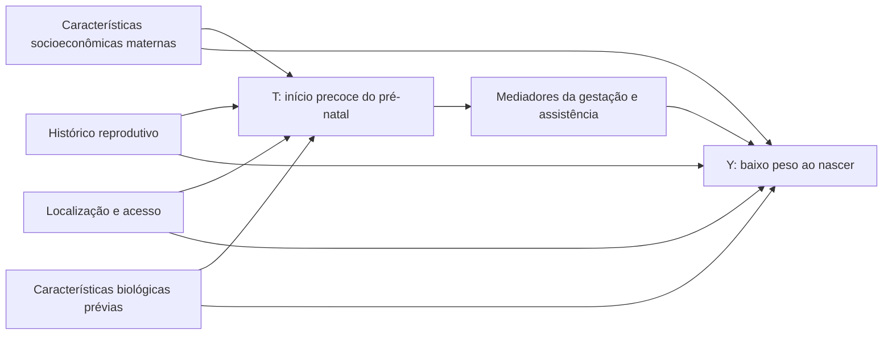

# DAG inicial de trabalho

Este DAG é deliberadamente pequeno. Ele orienta temporalidade e ajuda a evitar ajuste por variáveis posteriores ao início do pré-natal; não prova identificação causal.

## Leitura operacional

- Ajuste candidato: causas comuns observadas de T e Y nos blocos socioeconômico, histórico, acesso e biologia prévia.
- Não ajustar no propensity principal: número de consultas, idade gestacional ao nascer, tipo de parto, Apgar, Kotelchuck, local/estabelecimento do parto e demais mediadores ou consequências da assistência.
- `GRAVIDEZ` é definida na concepção e antecede T; na análise principal ela atua como critério de elegibilidade, restringindo a gestações únicas.
- `SEXO` é definido antes de T e pode predizer Y, mas não é causa plausível do início precoce no contrato principal; não é confundidor candidato.
- Confundidores não observados permanecem uma ameaça central.
